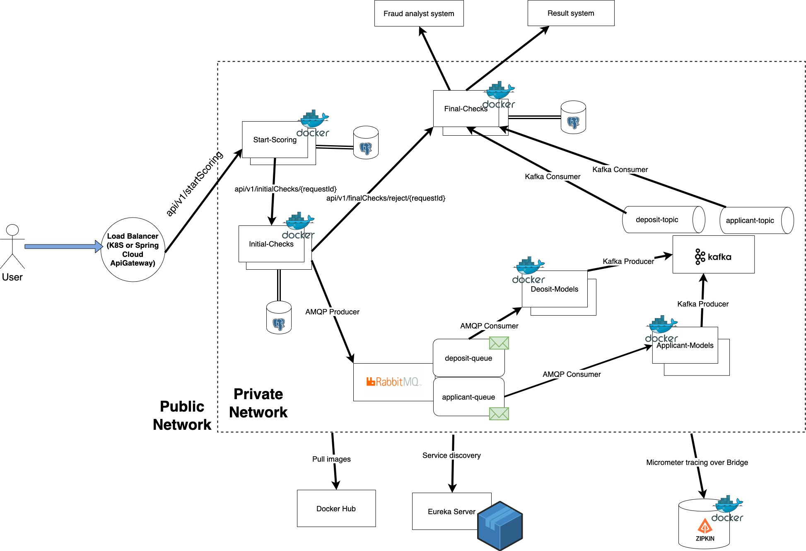
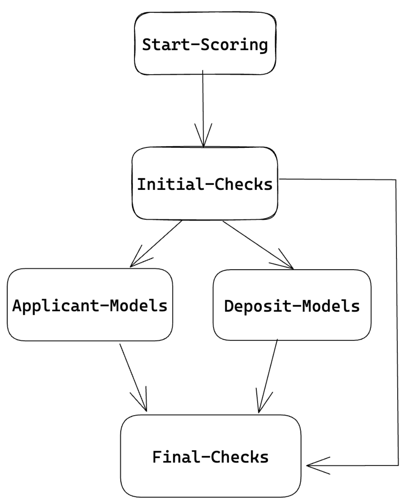

## Scoring system

- This is a system which depicts overall flow how clients and deposits are scored/assessed in the banks. It is not a
  precise copy, but more of a blueprint which can be used as a plan.
- During creation, I simulated certain integrations which are usually done during the process.

### Overall architecture and tech stack

**Architecture**

- The system was done using microservices architecture as it enables each service to focus on the domain - DDD.
- Moreover, microservice architecture shines in the system when we want certain parts to fail fast, but certain
  to wait till the service will wake up. Also, it is much easier to deploy such services in containers if Docker
  is used, or pods in K8S

**Tech stack**

- **Java 17**. **Java** is used as it is the most common language for such systems due to compiled-time feature and
  backward compatibility. 17 version is chosen as it is the latest LTS one. As usual, for minimizing boilerplate
  code I use `@Lombok` library
- For building the project I use **maven**. As in best practices, I have main `pom.xml` with parent dependencies
  and all child `pom`s either use something from parent `pom`s or use their own dependencies.
    - Moreover, I have services which are used as dependencies in other services `pom`s. It is done to either separate
      concerns or minimize code duplication as the presented code may be used in multiple services
    - Next, in services which are SpringBoot applications (not used as complimentary tools) there are 3 main plugins
      implemented:
        * `maven-compiler-plugin` for compiling code
        * `spring-boot-maven-plugin` for creating standalone application which is able to run on its own
        * `jib-maven-plugin` for creating and pushing docker images to the **docker registry**. In our case - **Docker
          Hub**
- **SpringBoot**, **Spring Cloud** are used as main frameworks. Former is used for running application whilst latter
  mainly for **Feign** and **ApiGateway** (this one is added as additional feature to see how Spring Cloud allows to
  create it)
- **RabbitMQ** and **Kafka** are used as brokers. Former is a queue type for decoupling __initial-checks__ service with
  2 AI
  services: __applicant-models__ and __deposit-checks__. And later is for decoupling 2 AI services mentioned above
  with __final-checks__ service
- Each service, where it is required, has **PostgreSQL** database to store data in it. Database per service is done due
  to
  good practice where we don't allow other services to use another service database without communication through
  the owning service
- Continuing with databases: also I used hibernate, not the raw one, but **Spring Data JPA**. Traditional `@Entity` and
  `@Repository`
- **Observability** is a pretty important factor, hence I also implemented it: logs, metrics, tracing:
    - TODO: **logs** are to be stored in the database
    - **metrics** - SpringBoot actuator
    - **tracing** - Micrometer tracing using Brave. ZipKin for visualization

### Precise explanation of each service

1. `start-scoring`
    * It is a service which accepts requests from the outer world (either through API Gateway or direct request)
    * It accepts request with 2 objects: applicant and deposit. Then it saves those 2 entities into 2 tables in the database
    * After that it sends request to the `initial-checks` service and waits for the response
    * When response comes back there are 2 main variants. In all cases `start-scoring` service updates last
      interaction in those 2 tables. 2 main cases:
        * sends **200 OK** to the user that data has been sent accepted and now in the Thread Pool Executor
        * there is some error and service catches it and presents the error

2. `initial-checks`
    * It is a service which has a complex flow with many checks about _applicant_ and _deposit_
    * At first, it accepts HTTP request from the `start-scoring` service. It saves data to its own database with
      similar 2 tables
    * Then it separates the request into 2 categories: applicant and deposit. Afterwards 2 separate Thread Pool
      Executors are activated and there is a complex system which assesses those 2 entities. In current version those checks have
      `log` and serve as a template (plus random case that REJECT decision has been made during those checks). Each of the 
      2 flows has FlowContext variable which is sent from flow to flow which keeps all the required data about the applicant or deposit.
    * If some check worked - it uses method in **CheckAction** abstract class which in turn calls another `@Service` which
      sends request to the `final-checks` service bypassing all AI models services (here **FeignClient** is used).
      `final-checks` will deal with it - persists data and sends request to the required system
    * If everything worked well - data is sent to 2 different queues in RabbitMQ using producer:
        * one for applicant and other - deposit

3. `applicant-models`
    * Service responsible for scoring applicant using AI models
    * It has Rabbit Listener, consumer, which listens to the certain queue
    * As new data comes in, it kicks the process of scoring using the models. In current version it doesn't have AI
      models
    * After everything is done and decision is given, data is sent to _topic_ in Kafka dedicated for applicants

4. `deposit-models`
    * Service responsible for scoring deposit using AI models
    * It also has Rabbit Listener, consumer, which listens to the certain queue
    * As new data comes in, it kicks the process of scoring using the models. In current version it doesn't have AI
      models
    * After everything is done and decision is given, data is sent to _topic_ in Kafka dedicated for deposits

5. `final-checks`
    * It is a service where Kafka Listeners listen to new data in 2 topics: for applicants and deposits
    * After new data comes in, it is persisted to the database
        * **Important:** here application uses Natural Join instead of traditional foreign key as there 2 unrelated
          topics, and it would be much more difficult and resource consuming to use ids
    * There is a Scheduled service which runs every specified time frame and takes data from the database based on Sent status.
      Of course, here there is a lock applied so as no race condition occurred where same data is sent.
      There are 2 main choices:
        * Decision is ACCEPT or REJECT: data is sent to the system about decisions
        * Decision is MANUAL: data is sent to fraud analyst
    * Also, it has endpoint for `initial-checks` service which accepts requests from it when application failed on
    some checks in that service. In this case data will be persisted with REJECT decision.
      * **Important:** here as mentioned earlier, there are 2 separate tables which will be JOINed in Scheduled using Natural JOIN
